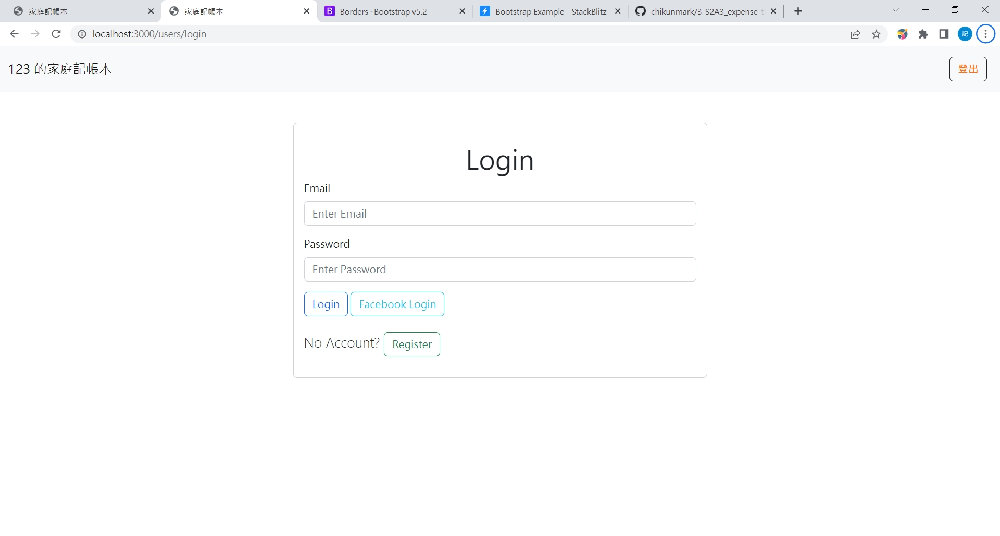
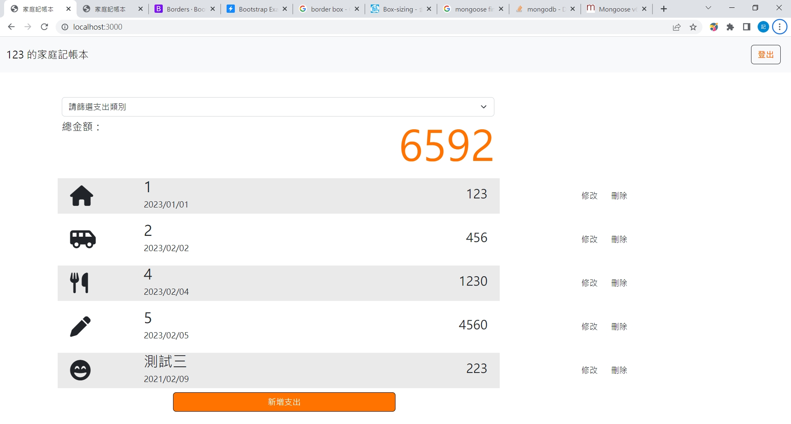

# 支出紀錄 - 廣志の私帳

本專案以練習路由、handlebars、帳密建立、CRUD 等等為主要目的，  
提供各位記錄支出的服務。  
為求達到練習效果，本人盡量以講師要求來設計功能、版面。  
需在登入後才能使用功能，請依網頁開啟後的畫面註冊帳號並登入，  
或是依照下列步驟，使用預設帳號登入服務。

先提供兩張簡圖 (如下)，讓您對本服務的外觀有初步了解。  
  
  
敬請自由使用。

## 如何才能使用

1. 開啟終端機 (git Bash / Terminal / console)，並 cd 至您想擺放專案的位置
2. 執行

```
git clone https://github.com/chikunmark/3-S2A3_expense-tracker.git
```

3. 安裝必要套件、並初始化

3.1 進入專案資料夾

```
cd 3-S2A3_expense-tracker
```

3.2 安裝必要套件

```
npm install
```

3.3 本專案有使用環境變數，請參考檔案 .env.example，建立您的變數 (.env 檔)

3.3 執行 seeder.js (輸入資料)

```
npm run seed
```

3.4 執行環境

```
npm run dev
```

4. 開啟瀏覽器 (Chrome, Firefox 等)，並進入以下網址，即可使用本專案

```
http://localhost:3000
```

5. 依畫面要求註冊帳號，或是使用下列預設帳密，然後登入服務  
   email: 123@example.com  
   password: 123

6. 若想停止環境 (停用專案)，請在終端機按下 Ctrl + C (windows)，或其 OS 的相應按鍵

謝謝您！

## 使用工具、套件

- Node.js@18.12.0
- npm@8.19.2
- express@4.18.2
- express-handlebars@3.0.0
- mongoose@5.9.13
- body-parser@1.20.1 (內建於 express，直接使用其功能)
- bcryptjs@2.4.3
- connect-flash@0.1.1
- express-session@1.17.1
- method-override@3.0.0
- passport@0.4.1
- passport-facebook@3.0.0
- passport-local@1.0.0"
- dotenv@16.0.3
